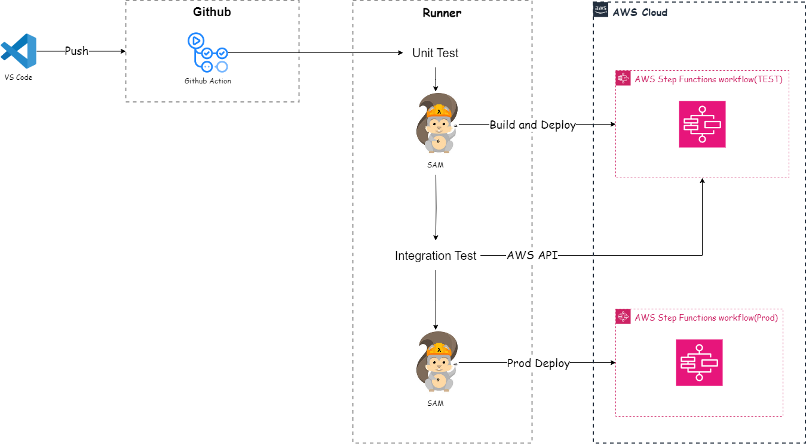

### 1. 프로젝트 개요

이 프로젝트는 AWS SAM(Serverless Application Model)과 GitHub Actions를 이용해 **서버리스 데이터 파이프라인**(https://kokoko12334.tistory.com/120) 의 인프라 관리, 테스트, 배포 자동화를 구현한 사례입니다. 

 SAM을 활용해 Lambda 함수와 Step Functions 등 AWS 서버리스 리소스를 손쉽게 정의하고 관리하며, GitHub Actions를 통한 CI/CD 파이프라인으로 지속적인 통합 및 배포를 구현했습니다.

자세한 내용은 https://kokoko12334.tistory.com/124 에서 확인 할 수 있습니다.


### 2. 아키텍처


- **AWS SAM**: 서버리스 리소스(Lambda, Step Functions)를 정의하고, 자동으로 배포합니다.
- **GitHub Actions**: CI/CD 파이프라인을 구축하여 코드 푸시 시 자동으로 유닛/통합 테스트를 실행한 후, 성공 시 AWS에 배포합니다.
- **Pytest**: Lambda 함수의 유닛 테스트와 Step Functions의 통합 테스트를 수행합니다.


### 3. 폴더 구조(etl-pipline)

```bash

├── build.sh
├── functions
│   ├── lambda function1
│   ├── lambda function2
│   ├── lambda function3
│   ├── lambda function4
│   └── lambda function5
├── samconfig.toml
├── statemachine
│   └── recipe_pipeline.asl.json
├── template.yaml
├── tests
│   ├── integration
│   │   └── test_state_machine.py
│   └── unit
│       ├── test_lambda function1.py
│       ├── test_lambda function2.py
│       ├── test_lambda function3.py
│       ├── test_lambda function4.py
│       └── test_lambda function5.py
└── utils
    ├── aws_ssm.py
    ├── logutils.py
    └── validation.py

```

- **functions**: 각각의 Lambda 함수가 저장된 폴더로, 프로젝트 내에서 여러 개의 Lambda 함수가 관리됩니다.
- **build.sh**: SAM 프로젝트를 빌드하는 스크립트 파일입니다.
- **statemachine**: AWS Step Functions 워크플로우 정의 파일이 저장된 폴더로, recipe_pipeline.asl.json 파일을 통해 상태 기계(State Machine) 구성을 관리합니다.
- **tests**: Lambda 함수와 Step Functions에 대한 유닛 테스트 및 통합 테스트가 위치한 폴더로, 개별 Lambda 함수를 유닛 테스트하고, Step Functions에 대한 통합 테스트도 포함됩니다.
- **template.yaml**: SAM 프로젝트의 인프라 정의 파일로, Lambda 함수, Step Functions, 그리고 기타 AWS 리소스들의 배포 설정을 관리합니다.
- **utils**: 데이터 검증, 로깅, 그리고 기타 유틸리티 기능을 담당하는 코드가 위치한 폴더입니다.